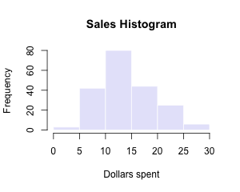
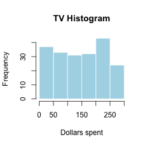
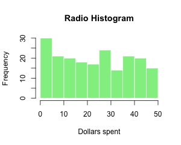
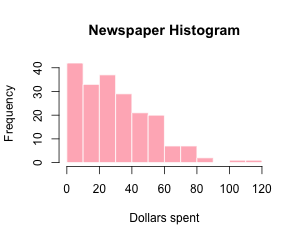
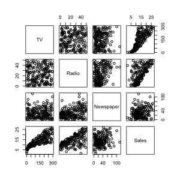
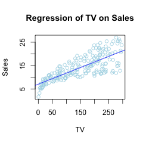
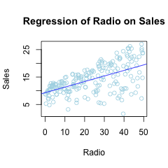
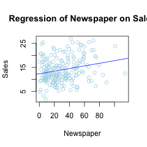
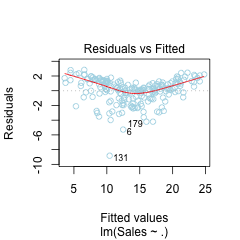

```{r setup, include=FALSE}
knitr::opts_chunk$set(echo = TRUE)
```

## Abstract

In this paper, we analyze a dataset containing continuous values for `Sales`, `Newspaper`, `Radio`, and `TV`. We attempt to establish a linear relationship regressing `Radio`, `Newspaper` and `TV` on `Sales` through, providing some visualization of the data and results of the model. This paper is supported by a similar analysis in Chapter 3 of *An Introduction to Statistical Learning*, by Gareth James, Daniela Witten, Trevor Hastie, and Robert Tibshirani.

## Introduction

We are typically concerned with two types of analysis: prediction and inference. In the case of prediction, we are interested in converting a vector of predictors into a target variable through some model: our primary concern is to accurately predict what the target variable will be given predictor values that we haven't seen before. In inference, we are more interested in providing interpretable results about the relationship between two or more quantities, where we may hope that there is a causal relationship.

In this analysis, we are focused on inference: we wish to understand how spending on different types of media advertising impacts sales. If there is a strong positive relationship between Sales and one of the media types, it may benefit the bottom line to increase or maintain spending in that area; if there is no relationship or possibly a negative correlation, we may consider decreasing the budget.

## Data
We are analyzing a set of 200 observations across 4 variables: the target, `Sales`, and three predictors, `TV`, `Radio`, and `Newspaper`. `Sales` represents number of sales of a particular product in thousands, while `TV`, `Radio`, and `Newspaper` represent dollar amounts of the advertising budget for each form of media respectively.

We can do a preliminary visual exploration of the variables to get a sense of their distributions - see page 2 and 3.









We then proceed to modeling the relationship between the variables.


## Methodology

A linear  model is almost never *true*: if there is a relationship between two variables, it is almost invariably more complicated than linear. However, linear models are surprisingly useful for prediction, and are very easy to interpret. They're also quite easy to compute -  these three properties have made them popular in analysis for a long time.

A multiple variable linear model (in this case, 3 variables without interactions) is often written as
$$ Y = \beta_{0} + \beta_{1}X_{1} + \beta_{2}X{2} + \beta_{3}X{3} $$
Where Y is the target variable and the $X_{i}$ are the predictor or input variables.

For this analysis, our model is
$$ Sales = \beta_{0} + \beta_{1}TV + \beta_{2}Radio + \beta_{3}Newspaper $$

$\hat\beta_{0}$ is simply an intercept which translates the line of best fit. The $\hat\beta_{i}$ are the values we are particularly interested in. A positive $\hat\beta_{i}$ indicates a positive correlation: more of $X_{i}$ spending is associated with higher Sales. We are interested in how large $\hat\beta_{i}$ might be, as this indicates the strength of the relation. However, we must also look at its *significance* to understand whether a relationship actually exists - just because we find a nonzero $\hat\beta_{i}$ does not imply that there is a true relationship. We use the t-test to evaluate how likely it is that the true $\beta_{i}$ is actually zero, and that our estimate $\hat\beta_{i}$'s distance from zero is due to chance.

## Results

First we do some exploration: we can perform a scatterplot to get a visual impression of their relationships, and we will plot our linear model on top to see how accurate our model seems.



This matrix can help us get a sense of whether a relationship exists between predictor and target, and can help us identify collinearity between variables, which can create problems in linear regression. We can also look at the quantitative correlations to help us.

```{r, echo = FALSE}
load("../data/correlation_matrix.Rdata")
library(pander)
panderOptions("digits", 4)
pander(corr, caption = "Correlation Matrix between all variable")
```

Fortunately, the relationship between `TV` and `Radio` seems very random- there does not seem to be any relationship. But `Neswpaper` seems somewhat correlated with `Radio`.

`TV` and `Radio` seem to have strong relationships with Sales. We take a closer look at the relationship between Sales and the three target variables, this time including the regression lines for one-variable models.







\pagebreak

Then we compute the linear model with `lm(Sales ~ .)` to perform inference:

```{r, echo=FALSE}
load("../data/regression.Rdata")
library(pander)
panderOptions("digits", 4)
pander(fit, caption = "Summary of Linear Regression Model of TV on Sales")
```

We first consider $\beta_{1}$ and its signficance. While the coefficient seems small, at `0.05`, we see that the t-statistic is quite large, making it very significant. In comparison, $\beta_{2}$ is larger, but its t-value is smaller (although still quite signficant). It's important to keep in mind that the value of a coefficient is highly dependent on the units of the variables and how they are scaled, so we are most interested in whether the $\beta_{i}$'s are positive and how significant they are. We see that $\beta_{3}$, representing the linear relationship between Newspaper and Sales, is slightly negative but quite insignificant at a p-value of `0.86`. It seems that we may want to exclude Newspaper as a predictor for Sales, as it seems generally uncorrelated with sales, and somewhat correlated with TV and Radio.

We compute some other goodness-of-fit statistics to evaluate how far off our model is.

``` {r, echo = FALSE}
#source("code/functions/regression-functions.R")
rss <- function(fit){
  sum(fit$residuals^2)
}

rsq <- function(fit) {
  summary(fit)$r.squared
}
tss <- function(fit) {
  #sum(anova(fit)$"Sum Sq")
  RSQ <- rsq(fit)
  RSS <- rss(fit)
  if (round(RSQ, 4) == 0) {
    return(RSS)
  }
  else {
    return(RSS/(1 - RSQ))
  }
}
fstat <- function(fit) {
  summary(fit)$fstatistic['value']
}

rse <- function(fit) {
  summary(fit)[[6]]
}

RSS <- rss(fit)
RSQ <- rsq(fit)
TSS <- tss(fit)
FST <- fstat(fit)
RSE <- rse(fit)
Statistic <- c("Residual Sum of Squares", "R-squared", "Total Sum of Squares", "F-statistic", "Residual Standard Error")
Value <- c(RSS, RSQ, TSS, FST, RSE)
fit_table <- data.frame(Statistic, Value)
library(pander)
pander(fit_table, caption="Goodness of Fit Statistics")
```

\pagebreak
We will also plot some visuals that can help us understand our model's fit.




## Conclusions

From our analysis, we can see that our model fits the data fairly well, even if the true relationship is not linear. Our R-squared value is fairly good, and this linear model may provide some value. If we wished to further explore the data, we would probably exclude Newspaper as a predictor and perhaps evaluate whether there is any significant interation between the two remaining predictors, TV and Radio.


